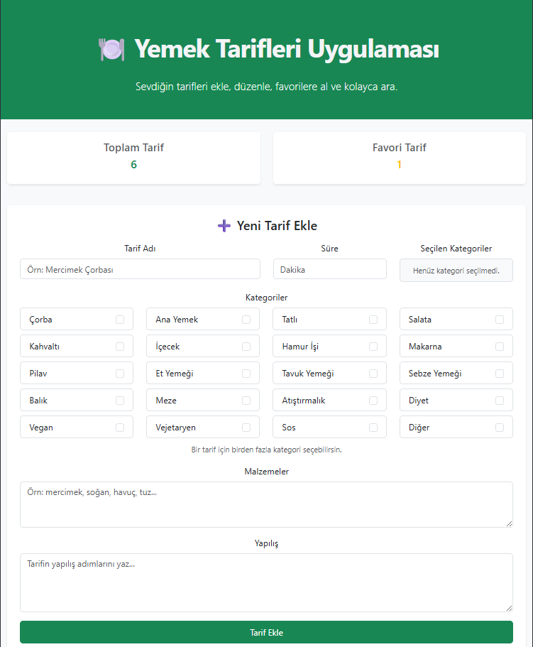
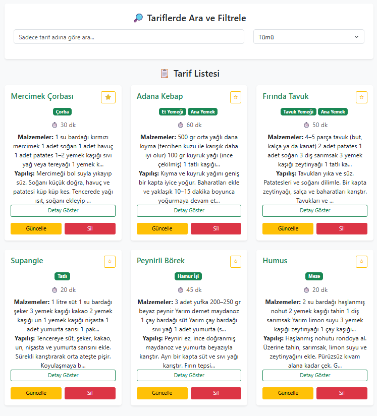

# 🍽️ Yemek Tarifleri Uygulaması

Bu proje React, JavaScript ve Bootstrap kullanılarak geliştirilmiş bir yemek tarifleri uygulamasıdır.

## Özellikler

- Tarif ekleme
- Tarif listeleme
- Tarif güncelleme
- Tarif silme
- Favorilere ekleme
- Arama
- Kategori filtreleme
- Birden fazla kategori seçme

## Kullanılan Teknolojiler

- React
- JavaScript
- Bootstrap
- localStorage

## Ekran Görüntüsü

<p align="center">
  
  
</p>

## Canlı Demo

--

## Kurulum

Projeyi çalıştırmak için:

```bash
npm install
npm run dev